# Diff of the conference-app from 2023 to 2024

author
:   unasuke

content-source
:  東京Ruby会議12 前夜祭

date
:  2025-01-17

theme
: theme

# 自己紹介

* Name: うなすけ
* Work: フリーランス
* Kaigi on Rails organizer
* {::tag name='x-small'}GitHub <https://github.com/unasuke>{:/tag}
* {::tag name='x-small'}Fediverse <https://mstdn.unasuke.com/@unasuke>{:/tag}
* {::tag name='x-small'}X (Twitter) <https://twitter.com/yu_suke1994>{:/tag}
* {::tag name='x-small'}<https://unasuke.com>{:/tag}

{:relative_width='24' align='right' relative_margin_right='-8' relative_margin_top='20'}

# さっきのワークショップで書いたコード
```ruby
CANVAS_SIZE = 800
DRAW_COUNT = 0

class Circle
  def initialize
    @x = rand(0..CANVAS_SIZE)
    @y = rand(0..CANVAS_SIZE)
    loop do
      @speed = rand(-10.0..10.0)
      break if abs(@speed) > 2.0
    end
    @angle = rand(0..Math::PI)
    @timing = [10, 20, 30, 40, 50].shuffle.first
  end

  def next_position(count)
    if count % @timing == 0
      @angle = rand(0..(Math::PI*2))
    end

    @x = @x + cos(@angle) * @speed
    @y = @y + sin(@angle) * @speed
    if @x >= CANVAS_SIZE || @y >= CANVAS_SIZE
      @angle += Math::PI
    end
  end

  def draw(count)
    next_position(count)
    fill("#0077B6")
    ellipse(@x, @y, 50, 50)

  end
end


def setup
  createCanvas(CANVAS_SIZE, CANVAS_SIZE)
  background("#CAF0F8")

  # noLoop
  @circles = 100.times.map { Circle.new }
  @draw_count = 0
end

def draw
  noStroke
  grid_size = 30
  background("#CAF0F8")
  @circles.each {|c| c.draw(@draw_count) }
  @draw_count += 1
end
```

# 東京Ruby会議12では「Rubyと暮らす」発表をけっこう幅広く募集しています!!!!!!!!!!!!(いました)

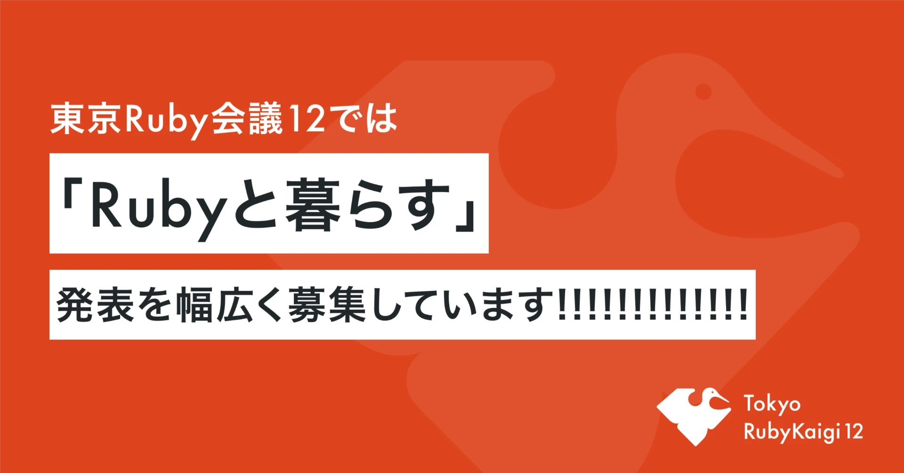{:relative_width='90' align='center'}

# https://note.com/tokyorubykaigi12/n/n14803ce700dd

> 「Rubyと暮らす」
>
> 東京Ruby会議12がめざす方向性をあえて一言で示すならば、こうなるでしょうか。Rubyを日々書いて暮らす、あなたの話を聞きたいです！ 小粒なものでも、大掛かりなものでも、どちらも歓迎です。

<https://note.com/tokyorubykaigi12/n/n14803ce700dd> より

# 「暮らし」
* カンファレンス(コミュニティ)は暮らしの一部
  * ですよね？

# 「暮らし」
* カンファレンス(コミュニティ)は暮らしの一部
  * ですよね？
  * 特に運営メンバーともなると、暮らしですよね？

# Kaigi on Railsは暮らし、そういうことにします

{::tag name='center'}
{::tag name='x-large'}というわけで暮らしの話をします{:/tag}
{:/tag}

# Kaigi on Rails 2024
* 参加していただけましたか？
* 楽しんでもらえましたか？

# Kaigi on Rails conference-app
* <https://app.kaigionrails.org>
  * <https://github.com/kaigionrails/conference-app>

# それはとあるafter eventでの出来事であった

{::tag name='center'}
{::tag name='x-large'}「へ〜、そんなアプリがあったんですね」{:/tag}
{:/tag}

# 2025年の抱負
2025年はもっとconference-appを宣伝する年にします

# Diff of the conference-app from 2023 to 2024

1. DB移行
2. Redis移行
3. Heroku脱出
4. Rails 8移行
5. Solid Queue移行

# 2024、一番やりたかったこと
Heroku脱出！


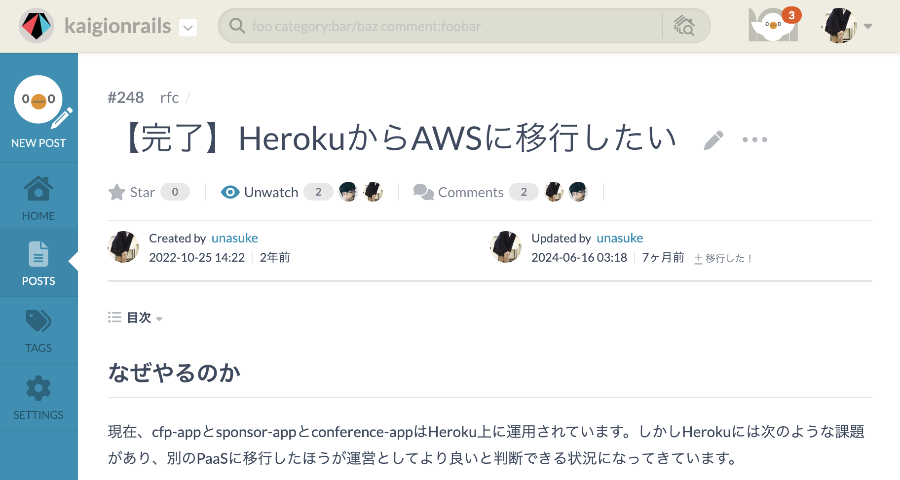{:relative_width='85' :align='center'}

# Why 脱Heroku？
* ログインセッションが短い
* インスタンスがUSにある
* HTTP/1.1しかサポートされていない
  * {::tag name='x-small'}※ 2024-11-21にHTTP/2がGAになりました{:/tag}
    * {::tag name='x-small'}<https://devcenter.heroku.com/changelog-items/3066>{:/tag}

# どうすれば脱Herokuできるのか？
* 小さいマネージドのPostgreSQLがあって
* 小さいマネージドのRedisがあって
* アクセスのない時はインスタンスを止めてくれて

そんなPaaS、IaaSがあればなあ……

# 移行先のPaaS候補
* Render.com
  * <https://render.com>
* Fly.io
  * <https://fly.io>

# 結局AWSに移行しました
* AWS App Runnerがある
  * Google CloudでいうCloud Run的な
* RubyKaigi側で使っているAWSアカウントを親にできる
  * (thanks sorah)
* GitHubアカウントでOIDCできる (thanks sorah)
  * <https://speakerdeck.com/sorah/serverless-idp-for-small-team-himari>
* 実はRubyKaigiのsponsor-appがApp Runnerに移行している

# AWS移行、DBとRedisはどうするの？
* ElastiCache Serverlessはあるけど……
* Aurora Serverlessは最小を0にできないし(最小は0.5 ACU)
  * (後述)

1年で1週間くらいしか稼動しないのにずっとリソース確保しっぱなしはしたくない！

# Serverless Postgres
* Neon
  * <https://neon.tech>
* Nile
  * <https://www.thenile.dev>

これならDBにアクセスしている時間のみの課金にできる！

# ヨッシャ移行するぞ

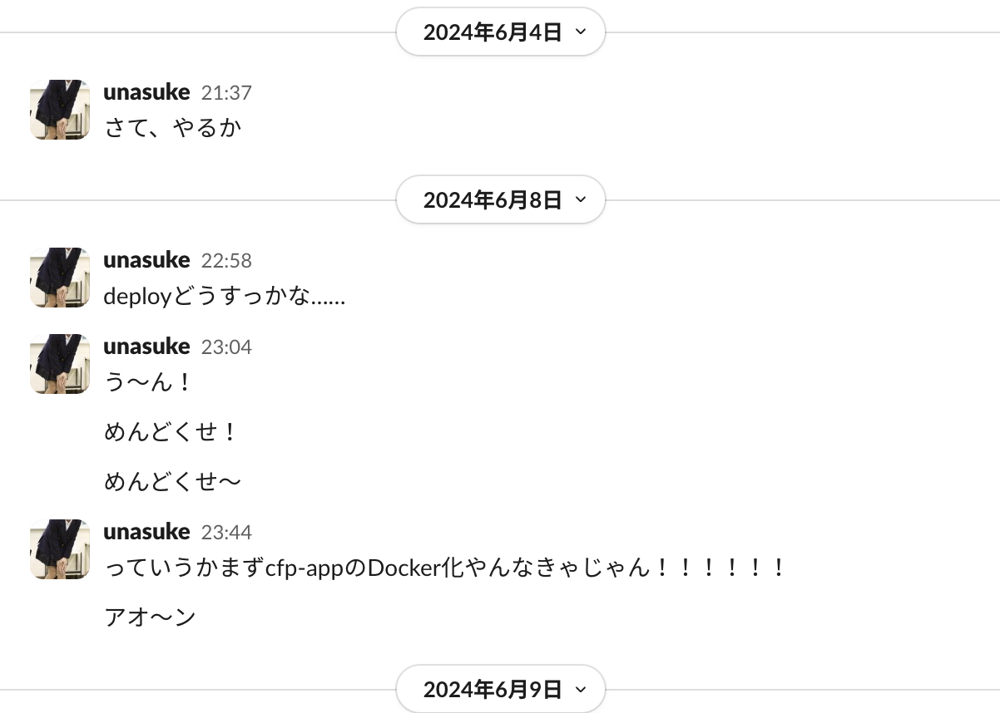{:relative_width='70' :align='center'}

# ヨッシャ移行するぞ

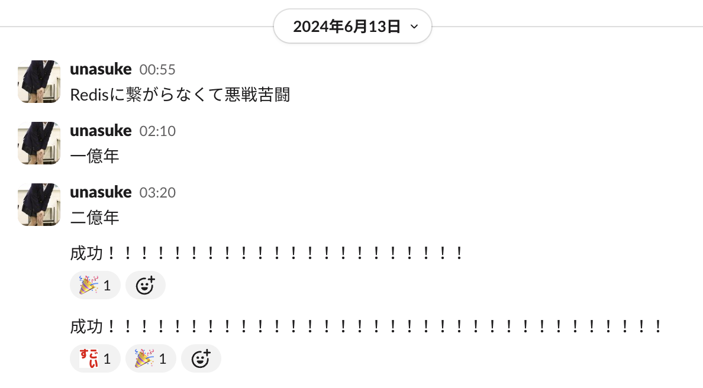{:relative_width='85' :align='center'}

# ヨッシャ
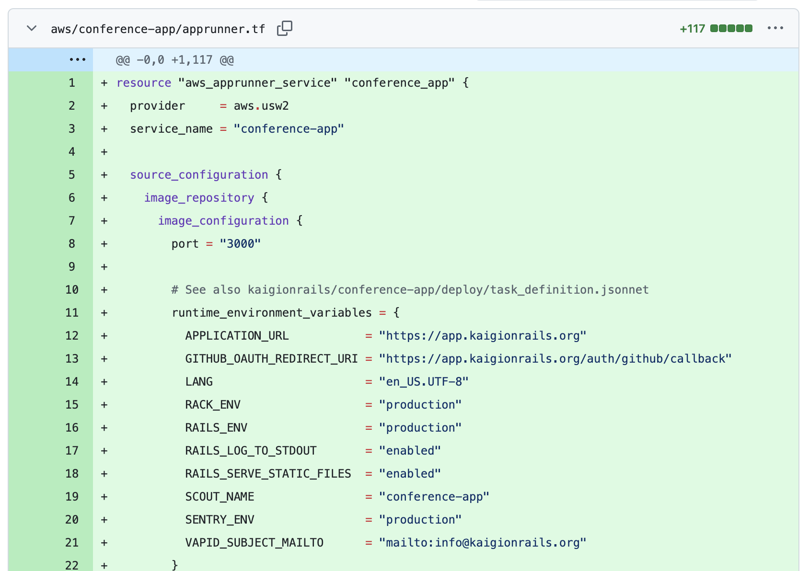{:relative_width='60' :align='center'}

<https://github.com/kaigionrails/terraform/pull/4>


# Diff of the conference-app from 2023 to 2024

1. DB移行
2. Redis移行
3. Heroku脱出 ← ココまで終わり
4. Rails 8移行
5. Solid Queue移行

# Rails 8移行
Rails 8 beta1 2024-09-27 released

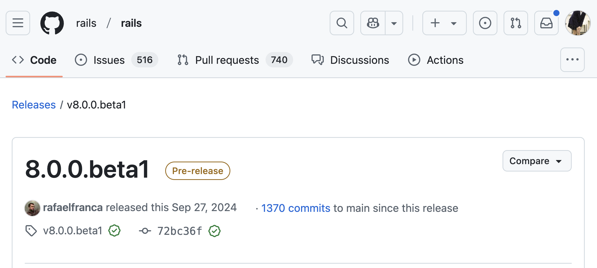{:relative_width='75'}

ところでKaigi on Rails 2024は10/25

# Rails 8 upgrade

conference-appの場合、以下の順でupdateをした

1. v7.1.3.4
2. v7.2.1
2. v8.0.0.beta1
3. v8.0.0.rc1 (Kaigi on Rails 2024開催中はここ)
3. v8.0.0.rc2 (10/30 released)
3. v8.0.0 (11/07 released)

# Is rails 8 upgrade hard?
<https://guides.rubyonrails.org/upgrading_ruby_on_rails.html#upgrading-from-rails-7-2-to-rails-8-0>

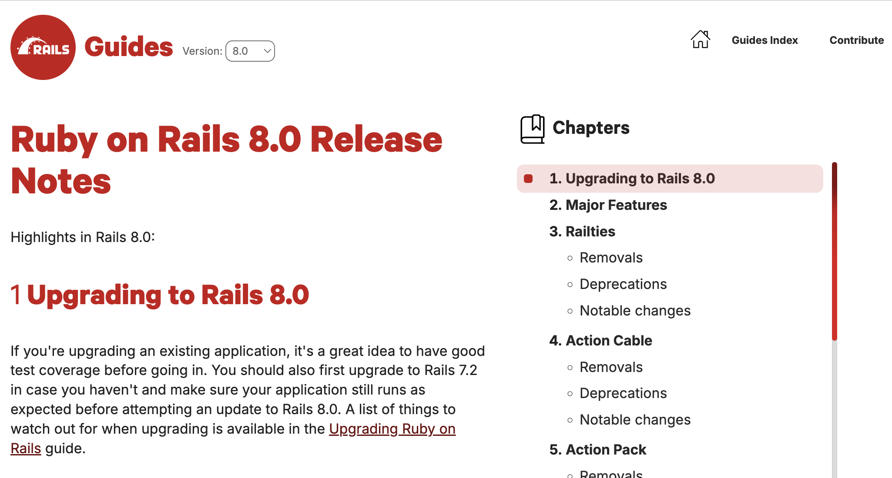{:relative_width='60'}

全然長くない！

# Diff of the conference-app from 2023 to 2024

1. DB移行
2. Redis移行
3. Heroku脱出
4. Rails 8移行 ← ココまで話した
5. Solid Queue移行

# Solid Queue移行
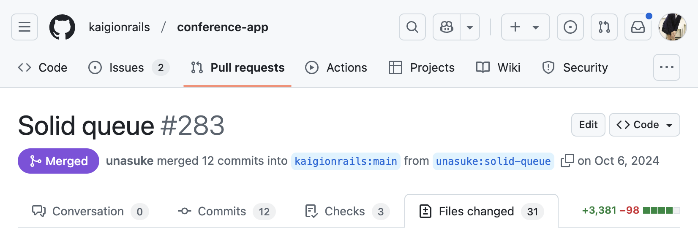{:relative_width='100' :align='center'}

やるだけ

(デカいdiffの大半はmigrationとrbsです)

# 現在の構成

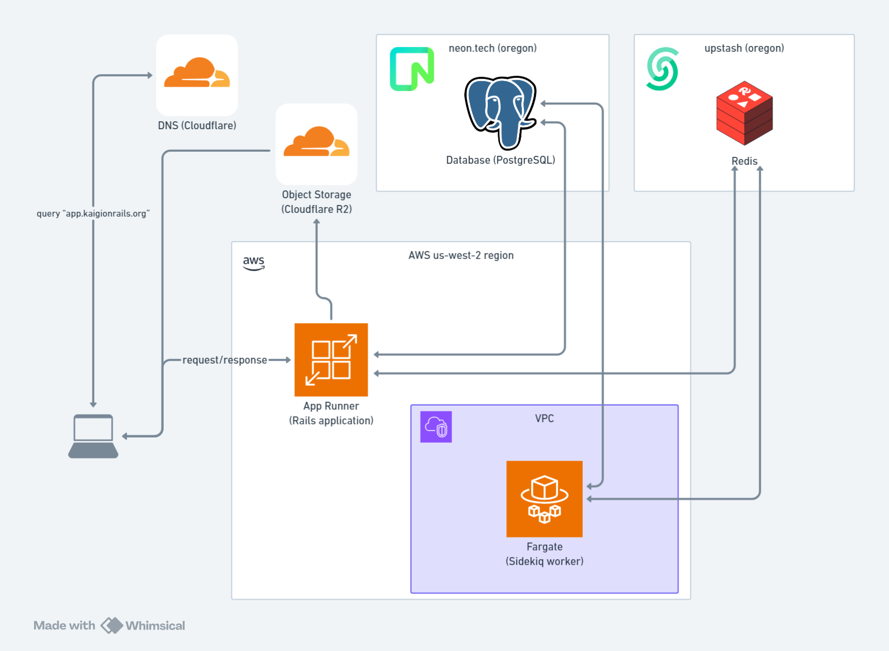{:relative_width="70"}

# Why 脱Heroku？
* ログインセッションが短い
* **インスタンスがUSにある**
* HTTP/1.1しかサポートされていない
  * {::tag name='x-small'}※ 2024-11-21にHTTP/2がGAになりました{:/tag}
    * {::tag name='x-small'}<https://devcenter.heroku.com/changelog-items/3066>{:/tag}


# 結局オレゴン(アメリカ)やん！
* はい……

# 2024-11-20 Amazon Aurora Serverless v2 update
Amazon Aurora Serverless v2 がゼロキャパシティへのスケーリングをサポート

> Amazon Aurora Serverless v2 では、0 個の Aurora 容量ユニット (ACU) へのスケーリングがサポートされるようになりました。このリリースにより、データベース接続に基づいて非アクティブ状態が一定期間続くと、データベースを自動的に一時停止できます。最初の接続が要求されると、データベースは自動的に再開し、アプリケーションの要求に合わせてスケールします。Aurora Serverless v2 は ACU 単位で容量を計算します。1 つの ACU は、約 2 ギビバイト (GiB) のメモリ、対応する CPU、およびネットワークから構成されます。容量範囲を指定すると、データベースはアプリケーションのニーズに合わせてこの範囲内でスケーリングされます。

<https://aws.amazon.com/jp/about-aws/whats-new/2024/11/amazon-aurora-serverless-v2-scaling-zero-capacity/>

# つまり……？
全てがap-northeast-1になる時代

# 要は？
* Kaigi on Rails 2025でもconference-appを使う予定です！
* ポートフォリオ置き場にAWSという選択はいかが？
  * 無理があるのではないか？

# たすきを渡す
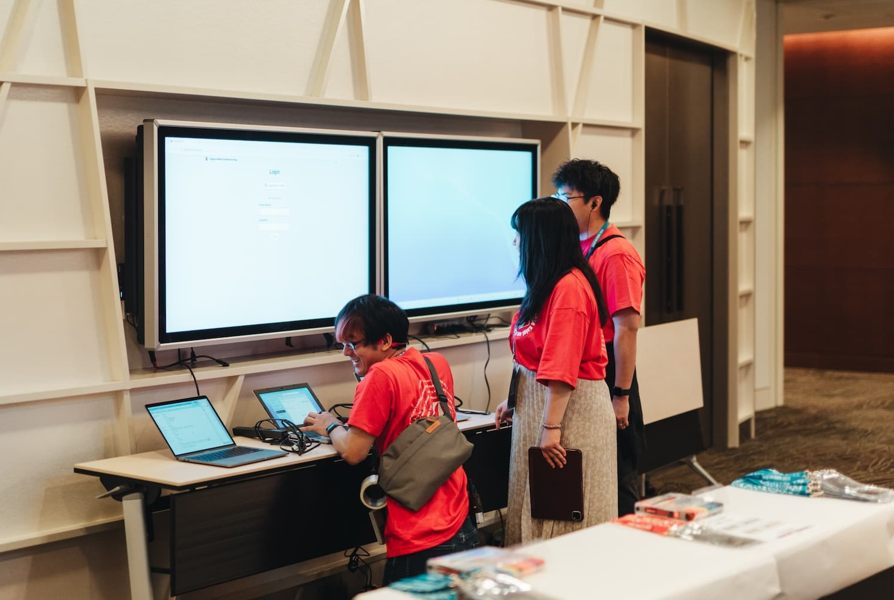{:relative_width='80' :align='center'}

# たすきを渡す
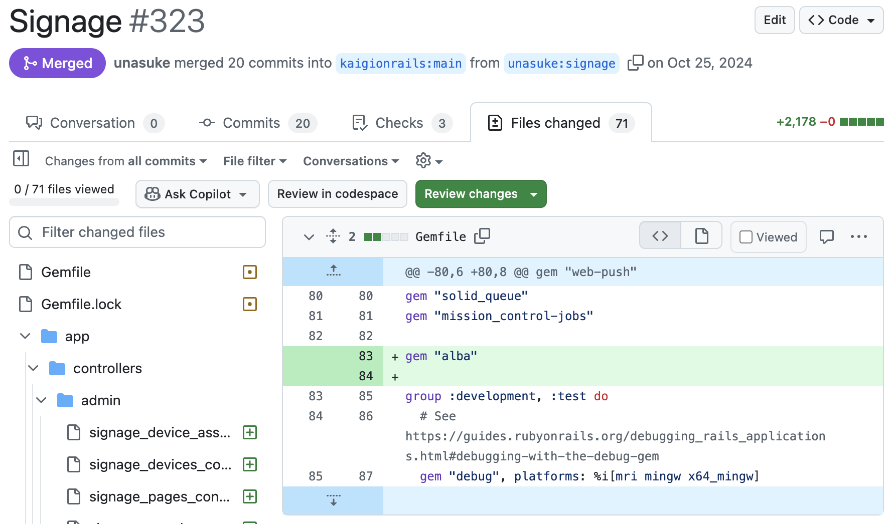{:relative_width='76' :align='center'}

<https://github.com/kaigionrails/conference-app/pull/323>

# たすきを渡す
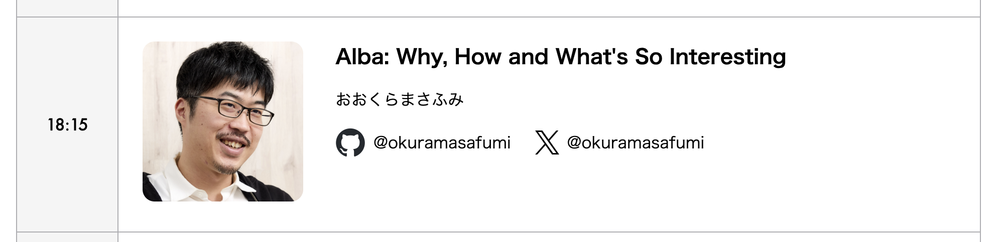{:relative_width='100' :align='center'}
